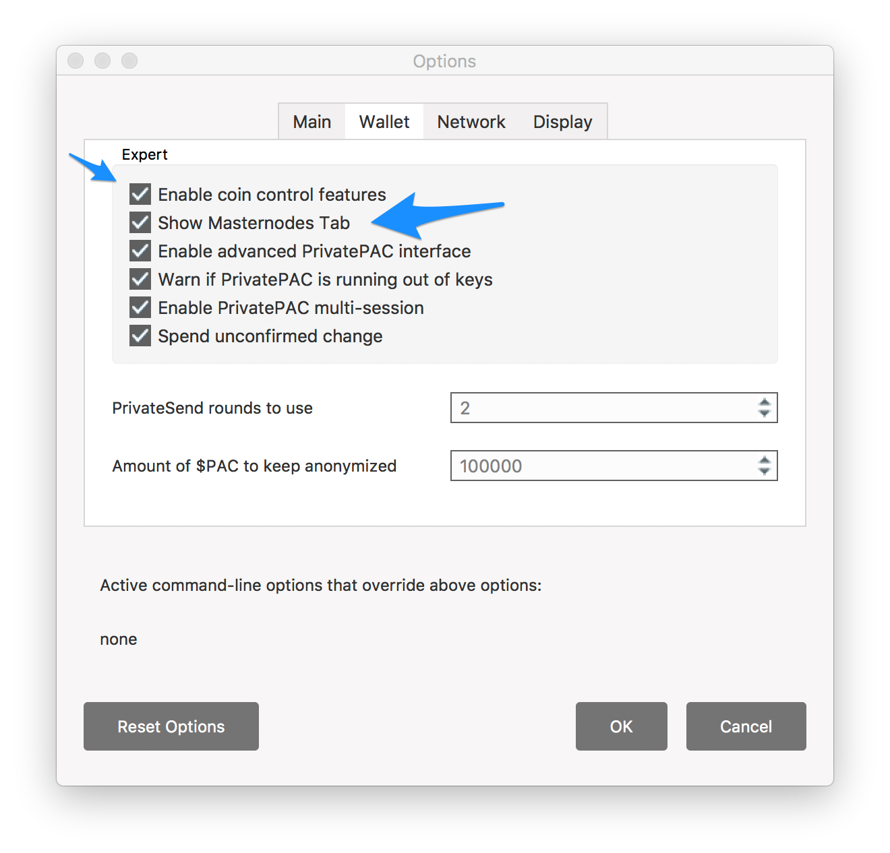

---
# Page settings
layout: default
keywords:
comments: false

# Hero section
title: Configure Your Desktop Wallet
description: 


# Micro navigation
micro_nav: true

# Page navigation
page_nav:
    prev:
        content: First Steps
        url: '/first-steps'
    next:
        content: Install your MN server
        url: '/install-server'

# disqus
comments: true
---

<p>&nbsp;</p>
We are now ready to install the official $Pac Desktop (cold) wallet. 
A quick reminder of where we are below:

<b>Steps to create your Master Node</b>

- [x] &nbsp; ~~1. Getting Ready~~
- [ ] &nbsp; <mark>2. Configure your desktop wallet</mark>
- [ ] &nbsp; 3. Install Master Node server on your VPS
- [ ] &nbsp; 4. Start your Master Node
- [ ] &nbsp; 5. Monitor your Master Node and collect rewards

<div class="callout callout--warning">
    <p>Make sure that you are using the <i>latest</i> $Pac wallet from the official $Pac website at <a href="https://wallets.paccoin.net/" target="_blank">https://wallets.paccoin.net/</a>. The current version is <i>v0.12.3.1</i> which you can verify by going to "About PaccoinCore" in Windows: File -> About or Mac: Paccoin Core -> About. 
    </p>
    <p>
    You will also need 500k of $Pac in order to collateralize your Masternode.
    </p>
</div>

# Enable Masternode Tab

Your cold wallet (desktop wallet) is used to remotely "start" your Masternode on the $Pac network. By "start", what it actually does is broadcast your MN onto the network along with its IP Address and Collateral Output to be verified and synchronized across all running MNs (Your MN is actually running remotely in your VPS which we will install in step 3 later). This is an important step as the network of Masternodes needs to verify, validate, then include your Masternode onto the network. 


In order to enable this capability, first we need to show the "MasterNodes" tab along the left hand side of the cold wallet, which normally isn't visible. Follow the steps below based on your desktop/laptop operating system:

## Windows

- 1\. Choose Settings -> Options to open the options window.


## Mac OS

- 1\. Choose Paccoin Core -> Preferences to open the options window.


<br/>
- 2\. Click on the Wallet Tab

- 3\. Select "Show Masternodes Tab" 



<div class="callout callout--info">
    <p>
    You <i>may</i> want to also select "Enable coin control features" for convenience (recommended). Don't worry about this or any of the other checkboxes for now. The only one you <i>really</i> need to select is "Show Masternodes Tab".
    </p> 
</div>

- 4\. Click "OK" to close the options window

- 5\. Exit and restart the cold wallet. You should now see the "Masternodes" tab on the left hand side below "Transactions".

<div align="center">

</div>


<br/>


# Generate Private Key

Now that we've restarted the $Pac cold wallet to show the masternodes tab, we now need to generate a _Masternode Private Key_ for your Masternode. 

<br/>

<div class="callout callout--info">
    Each Masternode has a unique set of parameters used for identification and validation in a unique set of values for each Masternode:
    <br/>
    <br/>
    <ul>
        <li>
            <i>Unique Masternode Private Key</i> for secure remote starts from cold/desktop to hot/masternode (this step).
        </li>
        <li>
            <i>Unique Masternode IP Address</i> for your MN vps to participate in the MN Network and second tier functions e.g. InstantSend
        </li>
        <li>
            <i>Unique Masternode Wallet Address</i> - the address where your MN rewards are sent.
        </li>
        <li>
            <i>Unique Masternode Collateral Output</i> - transaction output id of the 500K $Pac you send to yourself.
        </li>
        <li>
            <i>Unique Masternode Label</i> to be used in your desktop/cold wallet's masternode.conf file
        </li>
    </ul>
    <br/>
    Don't worry if all of the above doesn't make sense to you now, they will all be explained as we continue setup.
     
</div>

<br/>
The Private Key is used as a shared secret betwen your desktop cold wallet and your remote masternode, which is then used to authenticate rpc (remote procedure call) commands from your cold wallet. You'll need the Private Key in subsequent steps. Be sure to have your [Text Editor](/first-steps#text-editor) ready .

<br/>
---

<br/>

- 1\. From your $Pac Desktop Wallet, select Tools -> Debug Console


You will see the following window, and a command line at the bottom to type commands:


<br/>

- 2\. Type the following command in the input field (see blue arrow above). You can also click the copy icon below to copy the command onto your clipboard and paste them into the field using: Windows: Ctrl+V or Mac: Command+V.

<div class="example" >Generate Masternode Private Key
</div>
```bash
masternode genkey
```
<br/>

- 3\. Press Enter, and you will see a long alphanumeric string of characters as in the screenshot below. This is a new Private Key for your Masternode.


<br/>

- 4\. Select the whole sequence of characters, then copy/paste them into your text editor. We will need the MN Private Key you just created in 2 different places as part of the setup. Once you've copied the MN Private Key to your text editor, close out of the Debug Console and return to the main wallet screen.

<br/>


# Collateralize Masternode

The number of $Pac coins needed to collateralize a Masternode is *exactly* 500k (500,000). You will need to send this exact amount to yourself from your desktop wallet. 

## Create Unique MN Wallet Address

Every MN you own needs to have a unique label. If this is your first Masternode, you can label it as "MN1". Follow these steps and refer to the screenshot:


- 1\. Select the Receive tab on the left hand side of the cold wallet.

- 2\. Type a unique name for your Masternode (e.g. "MN1", in the screenshot it is labeled "MyMN1").

- 3\. Type in 500000 in the Amount field.

- 4\. Click the "Request Payment" button. A new dialogue window will appear, similar to the screen shot below:


- 5\. Click the "Copy Address" button, which will copy the address into your clipboard. Close the dialogue window to return to the main wallet and proceed to the next step.


## Send 500k Collateral

We will now send the required 500k $Pac collateral to the unique address we just created above. Since we also created a unique label (e.g. "MN1"), we can easily identify the correct address when sending it to ourselves. See the screen shot below and *carefully* follow the steps:


- 1\. Select the Send tab on the left hand side of the desktop wallet.

- 2\. Click your cursor into the "Pay to" field and paste the address we just copied. On Windows: Ctrl+V and on Mac Command+V. The "Label" field will automatically display the unique name we entered previously. *If* this doesn't auto-populate, then return to the Receive tab, select your newly created receive address, double click it to open up the dialogue and copy the address again (step 5 above), and paste it again.

<div class="callout callout--warning">
    <p><strong>Be Careful!</strong></p>
    <p>
    Make sure to double check that you are sending to the correct address in the steps above. 
    </p>
    <p>
    Additionally, if this is not your first Masternode, be sure to create a unique label and address for each one of your Masternodes. Not doing so will cause you a lot of grief as reusing addresses will mean you will only get paid for each unique.
    </p>
</div>

- 3\. Type in *exactly* 500000 in the "Amount" field.

- 4\. Click "Send" at the bottom of the screen.

- 5\. Enter your passphrase when prompted, select "Yes" to send, and your 500k $Pac transaction will be sent to the network to be confirmed on the blockchain.

## Get Collateral Tx Id

Now that you've sent yourself the necessary 500k $Pac collateral to a unique MN wallet address, we'll want to wait for 15 confirmations of the transaction. You can see how many confirmations your transaction has by selecting the "Transactions" tab and hovering your cursor over the transaction entry. 

<div class="callout callout--info">
    <p>
    Initially, your transaction is sent to the memory pool to be validated for its first confirmation. Every block that is mined "confirms" all previous transactions on the block chain. $Pac aims to average 2.6 minutes per block, and you will need 15 blocks to be mined and added to the block chain before your MN collateral is valid to enable your Masternode. These times vary however (network difficulty, network hashing power). You can see updating blocks as they move from the <a href="http://explorer.pachub.io/" target="_blank">$Pac Insight Explorer</a>. You can also get average daily blocks mined as well as a wealth of other information from sites such as <a href="https://masternodes.online/currencies/PAC/" target="_blank">Masternodes.online</a>.
    </p> 
</div>

Once your transaction has been confirmed at least 15 times, follow the steps below to create the Collateral Tx Id needed:

- 1\. From your $Pac Desktop Wallet, select Tools -> Debug Console


You will see the following window, and a command line at the bottom to type commands:


<br/>

- 2\. Type the following command in the input field (see blue arrow above). You can also click the copy icon below to copy the command onto your clipboard and paste them into the field using: Windows: Ctrl+V or Mac: Command+V.

<div class="example">Display Collateral Tx Id
</div>
```bash
masternode outputs
```
<br/>

- 3\. Press Enter, and you will see a long alphanumeric string of characters in quotation marks, a colon, then either "0" or "1", as in the example below:

```json
{

"a89rhtuyf23jd84120942acce447830aa83lkdl3k39s73m" : "1"

}
```
- 4\. Copy *only* the line and full string(not the '{' and '}' brackets) and paste onto your text editor.

- 5\. Remove all quote characters (") as well as the colon (:) and make sure that there is a single space between the end of the long string and the "0" or "1". From the example above, your final string should look similar to this:

```

a89rhtuyf23jd84120942acce447830aa83lkdl3k39s73m 1
```

<br/>
This is your unique collateral tx id for this Masternode.

<br/>

<div class="callout callout--warning">
    <p>
    If this isn't your first Masternode, you will see multiple entries (1 for each MN: the 500K sent to yourself). Make sure you choose the new entry for the MN you are currently configuring. Not doing so will cause a lot of grief and prevent your Masternode from properly starting. 
    </p>
</div>
<br/>

- 6\. Close out of the Debug Console and return to the main wallet screen.

<br/>

## Next Step: Install Masternode

<br/>

Now that we have properly collateralized our MN, our next step is to [Install your Masternode server](/install-server) on your remote vps.

<br/>
<br/>